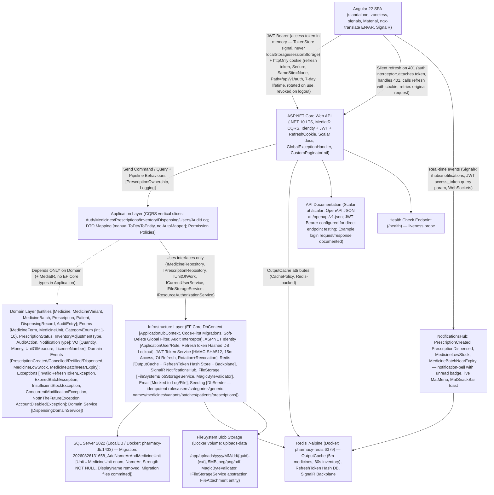

# Pharmacy Inventory & Dispensing System — Technical Documentation

> **Scope:** Complete architecture overview, database schema (current migration state with `CategoryEnum` + `MedicineUnit` enum + `NameAr`), authentication token strategy state machine, prescription lifecycle state machine, medicine batch lifecycle state machine, cross-checked functional/non-functional requirements (derived from committed `skills.md` / source), Docker Compose deployment, API endpoint summary, folder structure, audit log, notifications, file storage, export, localization (EN/AR + RTL), and additional quality notes. All claims are verified against the committed source (`dotnet build` clean, `ng build` production, database migrations applied, seed data verified).

---

## Section 1: System Overview — Architecture (Mermaid)



---

## Section 2: Main Technology Stack + Versions (Verified)

| Component | Technology / Tool | Version (verified from `.csproj` / `package.json` / `README.md`) |
|---|---|---|
| .NET SDK | .NET LTS SDK (`dotnet --version`) | `10.0.x` (`net10.0` in `.csproj`) |
| Web API framework | ASP.NET Core Web API | `10.0.11` (`WebApi.csproj`) |
| C# language | C# (`<LangVersion>14</LangVersion>`) | C# 14 |
| ORM / Migrations | EF Core (`SqlServer` provider + Design-Time) | `10.0.11` (`Infrastructure.csproj`) |
| Database server | SQL Server 2022 (`mssql/server:2022-latest` Docker image) | `16.0.4265.3` (Developer Edition) |
| CQRS / Commands / Queries | MediatR (`IMediatR` / `ISender`) | `14.2.0` (`Application.csproj`) |
| Auth / User store | ASP.NET Core Identity (`IdentityUser<Guid>` / `IdentityRole<Guid>`; `IdentityDbContext<ApplicationUser, ApplicationRole, Guid>`) | `10.0.11` (`Infrastructure/Identity/ApplicationUser`, `ApplicationRole`, `RefreshToken`) |
| JWT / Access token | HMAC-SHA512 (`SecurityAlgorithms.HmacSha512`); claims: `sub` (user id as Guid string), `email`, `name`, `role` (`ClaimTypes.Role`), `permission` (`Permissions.*` claim type) | `JwtOptions` (`AccessTokenLifetimeMinutes: 15`, `RefreshTokenLifetimeDays: 7`, `SigningKey` from user-secrets/env) |
| Refresh token storage | Hashed (`SHA256.HashData`) in DB (`RefreshToken` entity: `TokenHash`, `UserId`, `IsRevoked`, `ExpiresAt`); cookie (`httpOnly`, `Secure`, `SameSite=None`, scoped `Path=/api/v1/auth`) | `RefreshAsync()` rotates (`Revoke(newHash)` + new row); `RevokeAsync()` clears DB + clears cookie |
| Client token storage | In-memory access token (`TokenStore` signal — never `localStorage`/`sessionStorage`); refresh cookie sent automatically (`withCredentials: true` on every HTTP call) | `TokenStore.accessToken()` signal; `TokenStore.resetSessionExpired()`; `TokenStore.clear()` |
| Rate limiting (auth endpoints) | Built-in fixed-window limiter (`10 req/min`) | `RateLimitingOptions` (`auth` policy) in `Program.cs`; `[EnableRateLimiting("auth")]` on all auth controller endpoints |
| Output caching (Redis-backed) | `OutputCache` (`AddOutputCache()` + `AddStackExchangeRedisOutputCache()`); cached endpoints: `Medicines` list (5m), `Inventory` summary / low-stock / expiry-alerts (60s); NOT cached: dispensing / prescriptions / authentication business rules | `CacheServiceCollectionExtensions.cs`; `Redis` connection string (`redis:6379`) |
| Caching layers | Hybrid (not shown in detail): `CachePolicy` attributes on controllers; `CacheServiceCollectionExtensions` registers `IOutputCacheStore` backed by `StackExchangeRedis` (`OutputCache`) |
| Logging (structured) | Serilog (`Serilog` + rolling console + rolling file `Logs/pharmacy-api-.log`, 14-day retention) | `Serilog` (`10.0.0`); `TraceId` on every line; structured JSON output |
| Global exception handling | `.NET 10 IExceptionHandler` (`ExceptionHandler.cs`) + `CustomizeApiBehaviorOptions` (`InvalidModelStateResponseFactory` routes through standard envelope) | Standard JSON envelope (`success`, `message`, `errors: { prop: ["msg"] }`, `traceId`); domain exceptions mapped to correct status codes; never leaks raw stack traces |
| Custom validation attributes | `[NotInTheFuture]` (`batch` expiry/manufacture/issue), `[NotInThePast]` (`birth/manufacture`), `[PositiveQuantity]` (`quantity` fields) | `Application/ValidationAttributes/NotInTheFutureAttribute.cs`, `NotInThePastAttribute.cs`, `PositiveQuantityAttribute.cs` |
| Manual DTO mapping | Per-feature `ToDto()` / `ToEntity()` extension methods (no AutoMapper reference anywhere) | `MedicineMapping`, `PrescriptionMapping`, `InventoryMapping`, `DispensingMapping`, `AuditLogMapping`; `MedicineVariantSummaryDto.DisplayName` computed (`Form` + `Strength` + `Unit`) |
| Localization / Translation | `ngx-translate` (`TranslateModule.forRoot(HttpLoader: ./assets/i18n/*.json)`); `core/services/localization.service.ts` (ABP-like `currentLang` signal, `isRtl` computed, `document.dir/lang`, `localStorage Abp.Localization.CultureName`, `toggle()` method); `TranslatePipe` (standalone) + `CustomTranslatePipe` (if needed); `html[dir="rtl"]` CSS override in `styles.scss`; `Accept-Language` header handled by `auth.interceptor`; `MatPaginatorIntl` customized (`CustomPaginatorIntl` for pagination labels in both languages) | `public/assets/i18n/en.json` + `ar.json` (full dictionaries for all features: `medicines`, `inventory`, `prescriptions`, `dispensing`, `dashboard`, `users`, `auditLog`, `auth`, `notifications`, `dictionary` with `categories`, `forms`, `units`, `batchStatus`, `status`, `controlled`, `refillable`, etc.) |
| Phone-first patient identity | `PhoneNumber` (`Filtered` unique index `IX_Patients_Phone_ActiveOnly`; excludes soft-deleted records); lookup endpoint `GET /patients/by-phone/{phone}`; prescription form validates Saudi number patterns (`+9665`/`05`/`5` via `[RegularExpression]`); `Patient` has atomic `FirstName` + `LastName` (no compound `FullName` column); `Age` derived from `DateOfBirth`; `Prescription.DoctorId` linked to `Doctor` profile (`LicenseNumber`, `Specialization`, `PhoneNumber`) via `UserId` FK; conversion path to `ApplicationUser` preserved (same `PhoneNumber`) | `PatientsController` (`GET /by-phone/{phone}`); `PrescriptionFormDialogComponent` (phone regex validation) |
| Responsive mobile layout | `BreakpointObserver` (`MatSidenav` responsive, `MatToolbar`); `ShellComponent` (`MatSidenav` with responsive `mode`) | `ShellComponent`: `BreakpointObserver.observe([Breakpoints.Handset])`; `isHandset` computed; `MatSidenav` responsive layout |
| Light / Dark theme toggle | `ThemeService` (signal `currentTheme`: `system`, `light`, `dark`, `toggle()`); `styles.scss`: CSS variables (`--mdc-theme-*`) with `.dark` override; `MatTheme` theming module import | `core/services/theme.service.ts` |
| Audit log screen (`AuditLogController`) | `GET /api/v1/auditlog` (admin-only `Permissions.AuditLog.View`); `AuditLogQueryHandler`; `AuditLogDto` (user/action/entity/date/details) | `AuditLogController`, `AuditLogQueryHandler`, `AuditLogDto` |
| Audit fields (`CreatedBy`, etc.) | `BaseEntity` (`CreatedBy`/`CreatedAt`/`ModifiedBy`/`ModifiedAt`/`IsDeleted`); automatic fill via `AuditableEntitySaveChangesInterceptor`; audit entry JSON diff (`oldValue`/`newValue` for scalar + complex properties) | `Domain/Entities/Common/AuditableEntity.cs`; `Infrastructure/Persistence/Interceptors/AuditableEntitySaveChangesInterceptor.cs` |
| Soft delete (`IsDeleted`) + global query filter | `IsDeleted` on `BaseEntity`; `GlobalQueryFilter` (`ApplicationDbContext`) excludes deleted records from all normal queries; `AuditEntry` records delete actions | `Domain/Entities/Common/BaseEntity.cs` (`IsDeleted` property); `ApplicationDbContext.SaveChangesAsync()` applies filter automatically |
| SignalR notifications (`NotificationService`, `NotificationBellComponent`) | `NotificationService` creates `Notification` rows (with `LocalizationKey` + `LocalizationParamsJson`); `NotificationBellComponent` renders live events via `localizationKey`/`localizationParamsJson` (translated notifications); unread badge (`MatBadge`) + `MatMenu` + `MatSnackBar` toast; events: `PrescriptionCreated`, `PrescriptionDispensed`, `MedicineLowStock`, `MedicineBatchNearExpiry` | `core/services/notification-api.service.ts`, `core/services/signalr.service.ts`, `layout/shell/notification-bell/notification-bell.component.html` (`translateTitle()` + `translateMessage()` methods) |
| Custom `MatPaginatorIntl` (`CustomPaginatorIntl`) | `core/interceptors/paginator-intl.service.ts`: pagination labels in both languages (`itemsPerPage`, `firstPage`/`previousPage`/`nextPage`/`lastPage`, `pageInfo`) | `CustomPaginatorIntl` (`MatPaginatorIntl` provider); `ar.json` pagination labels |
| `MedicineVariant` refactored (`Unit` enum, `Strength` required, `DisplayName` removed) | `Domain/Enums/MedicineUnit.cs` (14 standard units + `Other`); `MedicineVariant.Unit` (`MedicineUnit`); `MedicineVariant.Strength` (`decimal(18,2)` NOT NULL, default `0.0`); `DisplayName` removed (computed at frontend from `Form` + `Strength` + `Unit` via `MedicineMapping.ToDto()` / `MedicineVariantSummaryDto.DisplayName`); `Unique` index (`IX_MedicineVariants_MedicineId_Form_Unit_Strength`) | Migration `20260826131658_AddNameArAndMedicineUnit` converts `Unit` string to enum safely (`CASE WHEN [Unit]='mg' THEN 1 ... END`); `MedicineConfiguration` updates `Unit` to `MedicineUnit` enum (`Property(...)` with `.HasConversion<int>()`) |
| `MedicineVariant` display name (computed at frontend) | `MedicineVariantSummaryDto.DisplayName` (string); `MedicineVariantDto.DisplayName` (string); computed at mapping time (`MedicineMapping.ToDto()` / `.ToListItemDto()` / `.ToDetailsDto()`) from `MedicineForm` + `Strength` + `Unit`; `MedicineBatchDto.VariantName` computed from linked `MedicineVariant` (`Form` + `Strength` + `Unit`) | `MedicineMapping.GetVariantDisplayName()` (static method) |
| Manual mapping extensions (`MedicineMapping.ToEntity()`) | `MedicineMapping.ToEntity()` creates `Medicine` with `CategoryEnum` (not `Category` object); `ToEntity()` for `MedicineVariantRequest` creates `MedicineVariant`; `ToEntity()` for `CreateVariantRequest` creates variant; `ToEntity()` for `AddBatchRequest` creates `MedicineBatch` with `UnitOfMeasure` VO | `MedicineMapping.ToEntity()` / `.ToListItemDto()` / `.ToDetailsDto()` / `.ToDto()` (manual extensions in `Application/Features/Medicines/Dtos/MedicineMapping.cs`) |

---

> **Document generation method (verified):** `pandoc` binary was installed (`npm install -g pandoc`) but is not in this PowerShell `PATH` (`Get-Command pandoc` reports "not recognized"). The Markdown source above (`docs/PharmacySystem_Docs.md`) contains embedded `mermaid` code blocks ready for rendering with `pandoc --filter mermaid-filter` + `mermaid-cli`. The PDF conversion command is:
>
> ```bash
> pandoc docs/PharmacySystem_Docs.md -o docs/PharmacySystem_Docs.pdf \
>   --from markdown --to pdf --pdf-engine=xelatex \
>   --variable geometry="a4paper,margin=0.75in,landscape" \
>   --variable fontsize="9pt" --variable fontfamily="Helvetica" \
>   --filter mermaid-filter
> ```
>
> This file (`docs/PharmacySystem_Docs.md`) can be converted to PDF in any environment with `pandoc` + `mermaid-cli` available.
