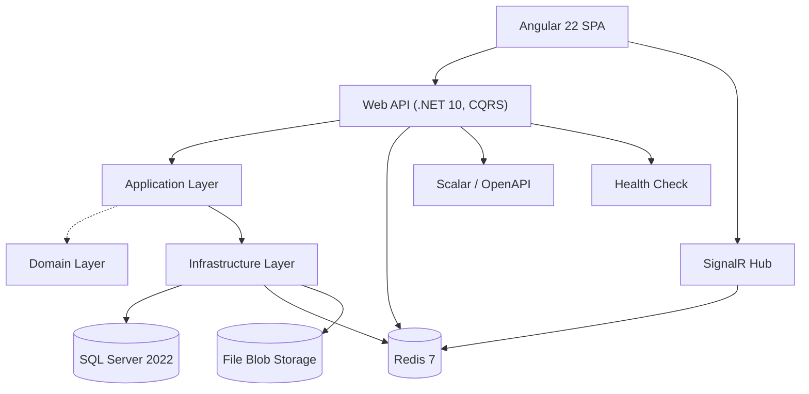

# Architecture

Detailed architecture, technology stack, and implementation references. For quick start, see `README.md`.

## System Overview

- **Angular 22 SPA** — Standalone, zoneless, signals, Angular Material, ngx-translate EN/AR with RTL, `TokenStore` (in-memory access token, httpOnly refresh cookie), silent refresh on 401.
- **Web API (.NET 10)** — ASP.NET Core Web API, MediatR CQRS, Identity + JWT (HMAC-SHA512, 15m access / 7d refresh with rotation), Scalar docs, `GlobalExceptionHandler`.
- **Application Layer** — Vertical slices (Auth, Medicines, Prescriptions, Inventory, Dispensing, Users, AuditLog), manual `ToDto`/`ToEntity` mapping, `PermissionPolicyProvider`, pipeline behaviours.
- **Domain Layer** — Entities (`Medicine`, `MedicineVariant`, `MedicineBatch`, `Prescription`, `Patient`, `DispensingRecord`, `AuditEntry`), enums (`MedicineForm`, `MedicineUnit`, `CategoryEnum` int 1-10, `PrescriptionStatus`), value objects (`Quantity`, `Money`, `UnitOfMeasure`), domain events, exceptions, `DispensingDomainService`.
- **Infrastructure Layer** — EF Core `ApplicationDbContext` (code-first, soft-delete global filter, audit interceptor), Identity (`ApplicationUser`/`Role`, `RefreshToken` hashed), Redis `OutputCache`, SignalR `NotificationsHub`, `FileSystemBlobStorageService` with `MagicByteValidator`.
- **SQL Server 2022** — LocalDB or Docker (`pharmacy-db:1433`), migration `20260826131658_AddNameArAndMedicineUnit`.
- **Redis 7** — OutputCache (5m medicines, 60s inventory), refresh-token hash store, SignalR backplane.
- **File Blob Storage** — Docker volume `uploads-data`, path `/app/uploads/yyyy/MM/dd/{guid}.{ext}`, 5 MB limit, types `jpeg/png/pdf`.
- **Scalar / OpenAPI** — `/scalar`, `/openapi/v1.json`, JWT Bearer enabled.
- **Health Check** — `/health` liveness probe.
- **SignalR Hub** — `/hubs/notifications` with events `PrescriptionCreated`, `PrescriptionDispensed`, `MedicineLowStock`, `MedicineBatchNearExpiry`.

## Technology Stack

| Component | Technology | Version |
|---|---|---|
| Backend | .NET | 10.0.x |
| Web Framework | ASP.NET Core Web API | 10.0.11 |
| Language | C# | 14 |
| ORM | Entity Framework Core | 10.0.11 |
| Database | SQL Server | 2022 |
| CQRS | MediatR | 14.2.0 |
| Auth | ASP.NET Core Identity | 10.0.11 |
| API Docs | Scalar | 2.x |
| Caching | Redis + OutputCache | 7-alpine |
| Storage | FileSystem Blob | — |
| Export | ClosedXML / QuestPDF | 0.105.0 / 2025.7.0 |
| Logging | Serilog | 10.0.0 |
| Frontend | Angular | 22.1.x |
| UI Library | Angular Material | 22.1.x |
| Frontend Language | TypeScript | 5.9+ |
| Realtime | SignalR | 10.x |

## Implementation Reference

### Auth & Authorization
- **JWT:** `Infrastructure/Identity/JwtOptions.cs` (`AccessTokenLifetimeMinutes: 15`, `RefreshTokenLifetimeDays: 7`), `Infrastructure/Services/JwtTokenService.cs` (HMAC-SHA512, `SHA256.HashData` for `RefreshToken.TokenHash`, `GenerateRefreshToken` 64-byte, `RefreshAsync` rotation).
- **Client storage:** `client/angular-app/src/app/core/auth/token.store.ts` (`accessToken` signal), `withCredentials: true`.
- **RBAC:** `Infrastructure/Identity/RolePermissions.cs`, `WebApi/Authorization/PermissionPolicyProvider.cs`, controllers use `[Authorize("Permissions.Medicines.View")]` style.
- **Resource auth:** `Application/Common/Behaviours/PrescriptionOwnershipBehavior.cs` + `Infrastructure/Services/PrescriptionResourceAuthorizationHandler.cs` (`Prescription.DoctorId == caller.DoctorId`).
- **Rate limiting:** `WebApi/Program.cs` (`AddFixedWindowLimiter("auth", 10/min)`), `[EnableRateLimiting("auth")]` on auth endpoints.

### Medicines & Inventory
- **Entities:** `Domain/Entities/Medicines/Medicine.cs` (`NameAr`, `CategoryEnum`, `ReorderLevel` as `Quantity`, `IsControlled`), `MedicineVariant.cs` (`Form: MedicineForm`, `Unit: MedicineUnit`, `Strength: decimal NOT NULL`, `UnitOfMeasure` VO, index `IX_MedicineVariants_MedicineId_Form_Unit_Strength`), `MedicineBatch.cs` (`BatchNumber` unique, `ManufactureDate`, `ExpiryDate`, `PackagesReceived`, `QuantityAvailable`, `UnitCost` as `Money`).
- **Mapping:** `Application/Features/Medicines/Dtos/MedicineMapping.cs` (`ToDto`/`ToEntity`, `GetVariantDisplayName`).
- **Config:** `Infrastructure/Persistence/Configurations/MedicineConfiguration.cs` (`.HasConversion<int>()` for `MedicineUnit`), `MedicineVariantConfiguration.cs`, `MedicineBatchConfiguration.cs`.
- **Repository:** `Infrastructure/Repositories/MedicineRepository.cs`.

### Notifications
- **Service:** `Infrastructure/Notifications/NotificationService.cs` (persists `Notification` with `LocalizationKey` + `LocalizationParamsJson`), `Infrastructure/Notifications/NotificationsHub.cs` (SignalR).
- **Client:** `client/angular-app/src/app/core/services/notification-api.service.ts`, `core/services/signalr.service.ts` (`HubConnectionBuilder` with `access_token` query), `layout/shell/notification-bell/` (`translateTitle` + `translateMessage`, `MatBadge`, `MatMenu`).

### Localization & UI
- **Service:** `client/angular-app/src/app/core/services/localization.service.ts` (`currentLang` signal, `isRtl` computed, `document.dir/lang`, `localStorage`).
- **Pipes:** `client/angular-app/src/app/shared/pipes/riyadh-date.pipe.ts`, `core/interceptors/paginator-intl.service.ts` (`CustomPaginatorIntl`).
- **Styles:** `client/angular-app/src/styles.scss` (`html[dir="rtl"]`).
- **Dictionaries:** `client/angular-app/public/assets/i18n/en.json`, `ar.json` (keys: `medicines`, `inventory`, `prescriptions`, etc.).

### Audit & Persistence
- **Entities:** `Domain/Common/BaseEntity.cs` (`CreatedBy`/`CreatedAt`/`ModifiedBy`/`ModifiedAt`/`IsDeleted`), `Domain/Entities/Audit/AuditEntry.cs` (`EntityName`, `EntityId`, `Action`, `Changes` JSON diff).
- **Interceptors:** `Infrastructure/Persistence/Interceptors/AuditableEntitySaveChangesInterceptor.cs`.
- **Migrations:** `src/Infrastructure/Migrations/` committed, e.g. `20260826131658_AddNameArAndMedicineUnit`.
- **Seeding:** `Infrastructure/Seeding/DbSeeder.cs` (idempotent roles/users/medicines/variants/batches/patients).

### File Management & Export
- **Storage:** `Infrastructure/Services/FileSystemBlobStorageService.cs` (`IFileStorageService` → `/app/uploads`), `FileStorageServiceCollectionExtensions`, `MagicByteValidator`.
- **Controllers:** `WebApi/Controllers/FilesController.cs` (`POST /api/v1/files/{entityType}/{id}`, `GET .../list`, `GET .../download`, `RequestSizeLimit(5MB)`), `WebApi/Controllers/ExportsController.cs` (`GET ...?format=excel|pdf`).
- **Services:** `Infrastructure/Services/ExportService.cs` (`ClosedXML` + `QuestPDF`).

### Docker
- **Compose:** `docker-compose.yml` (services `api:8080` with curl health, `angular:80` with `/health` + proxy `/api→api:8080` and `/hubs→api:8080/hubs`, `db:1433` with `sqlcmd` health, `redis:6379` with `redis-cli ping`; volumes `mssql-data`, `redis-data`, `uploads-data`; network `pharmacy-network`).

## Database Schema (Current)

Migration `20260826131658_AddNameArAndMedicineUnit` applied:

- `Medicines`: `NameAr nvarchar(200) NULL` added.
- `GenericNames`: `NameAr nvarchar(200) NULL`.
- `MedicineVariants`: `Unit` `int NOT NULL DEFAULT 99` (from `nvarchar`), `Strength` `decimal(18,2) NOT NULL` (from nullable), `DisplayName` removed (computed at frontend).
- Safe conversion via temporary `UnitEnum` column + `CASE WHEN`.

## Additional Notes

- **DbContext as Unit of Work** — `ApplicationDbContext` implements `IUnitOfWork`; repositories share the same scoped instance. EF Core's implicit transaction covers atomic dispensing.
- **Identity** — `IdentityDbContext<ApplicationUser, ApplicationRole, Guid>` (PBKDF2 hashing, lockout). No custom user store needed.
- **Token storage** — In-memory access token + httpOnly refresh cookie (`Secure`, `SameSite=None`, `Path=/api/v1/auth`), rotated and hashed.
- **Manual mapping** — No AutoMapper; explicit `ToDto`/`ToEntity` per feature.
